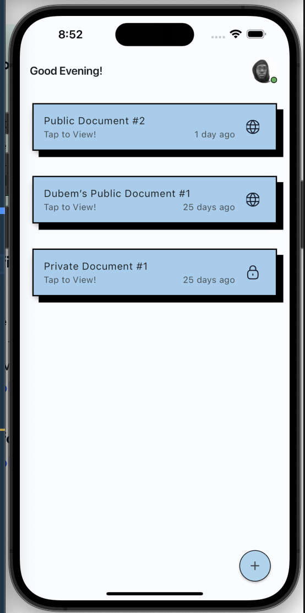
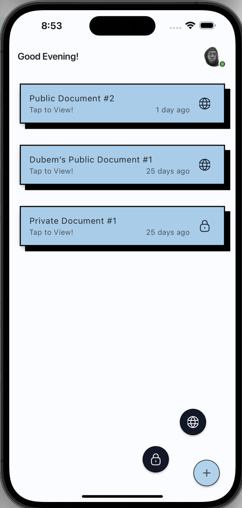
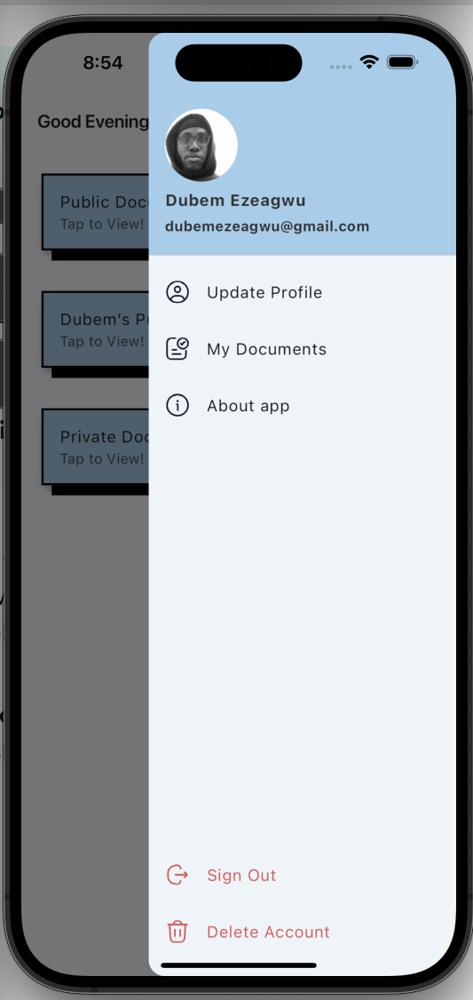
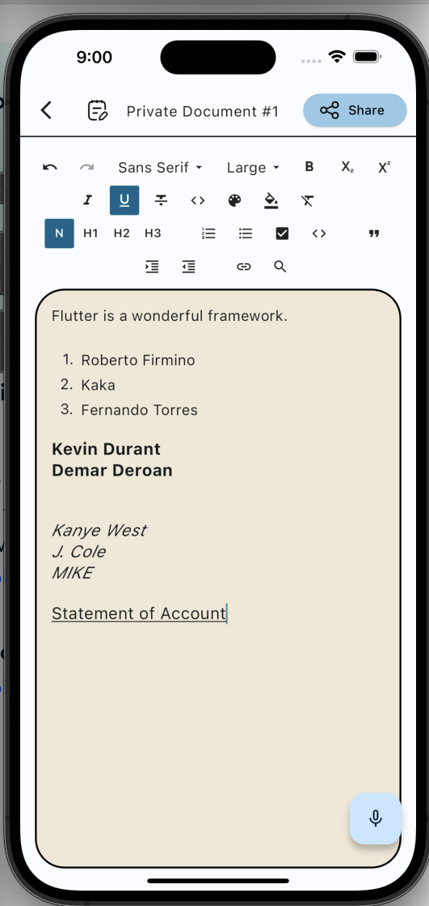
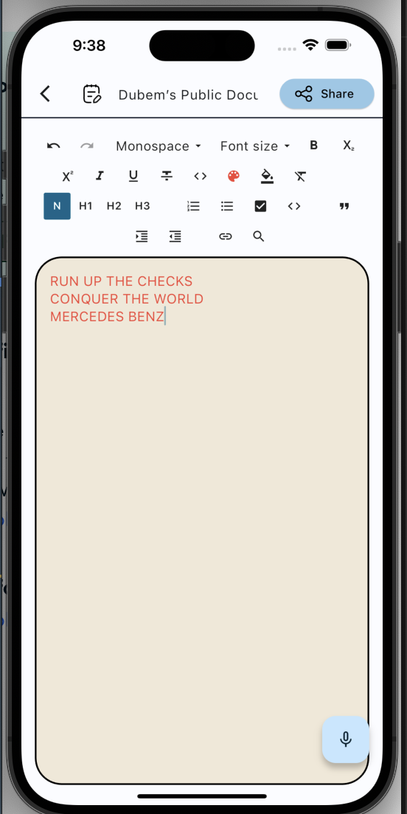
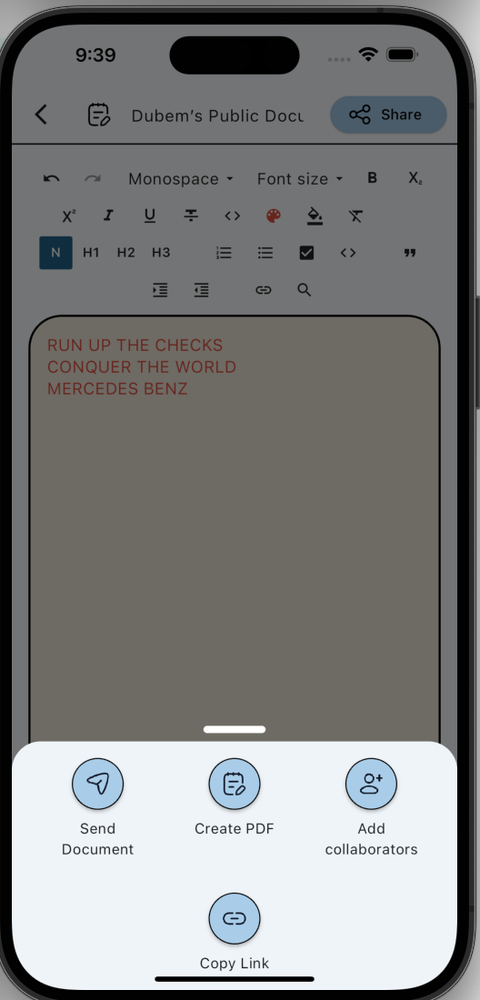
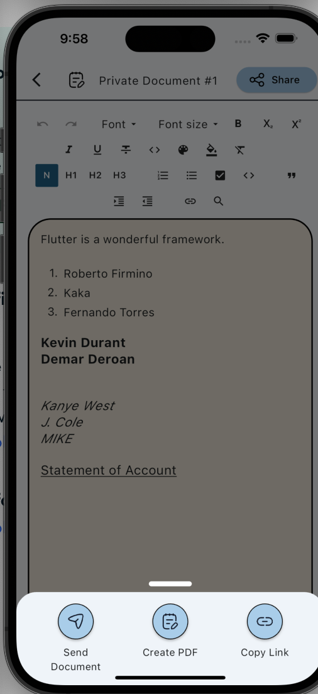
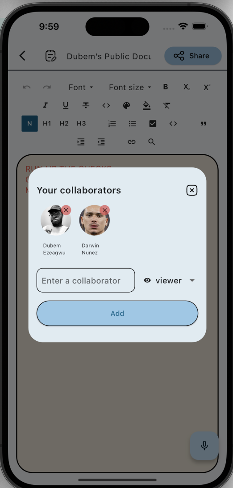

# docs_sync

## Overview

`docs_sync` is a comprehensive project designed to facilitate document synchronization across various platforms including Android, iOS, Web, and Desktop. It leverages Flutter for the client-side application, ensuring a seamless user experience across devices, and Node.js with Express.js for the server-side logic, managing backend operations and API endpoints. Mongoose is also used for MongoDB object modelling.

## Features

- Cross-platform document synchronization.
- Real-time updates and syncing using sockets.
- Secure authentication and authorization mechanisms.
- RESTful API for efficient data exchange between client and server.

### Major Packages used:
- Flutter Riverpod (State Management)
- Go-Router (Routing)
- Google Sign In (Google Auth)
- HTTP (Networking)
- Flutter Quill (Text Editing)
- Socket IO Client (Real-time Communication)

## Getting Started

### Prerequisites

Ensure you have Node.js installed on your system. You can download it from [Node.js official website](https://nodejs.org).

For Flutter development, ensure you have the latest stable version of Flutter SDK installed. Follow the installation guide on the [Flutter official website](https://flutter.dev/docs/get-started/install).

### Installation

**1. Clone the Repository:** Open your terminal and clone the "Docs Sync" repository to your local machine:

```sh
$ git clone https://github.com/dubemezeagwu/docs_sync
```

**2. Navigate to the Project Folder:** Change your working directory to the project folder:

```
$ cd docs_sync
```

#### Server-Side Setup

1. Navigate to the server directory.
2. Install dependencies by running `npm install`.
3. Start the server by running `npm start`.

#### Client-Side Setup

1. Navigate to the client directory.
2. Ensure Flutter is set up correctly on your system.
3. Run `flutter pub get` to fetch dependencies.
4. Start the Flutter application by running `flutter run`.

## Usage

### Server-Side

The server provides several API endpoints for managing documents and users. Refer to the `/routes` directory for detailed route definitions and expected request/response formats.

### Client-Side

Use the Flutter application to synchronize documents across devices. The application will automatically sync changes made to documents in real-time.

## Contributing

Contributions to improve the functionality and performance of `docs_sync` are welcome. Please feel free to submit pull requests or open issues for discussion.

## License

This project is licensed under the MIT License. See the LICENSE file for more details.

## Screenshots
<table>
  <tr>
    <td></td>
    <td></td>
    <td></td>
  </tr>
  <tr>
    <td></td>
    <td></td>
    <td></td>
  </tr>
  <tr>
    <td></td>
    <td colspan="2"></td>
  </tr>
</table>

<!-- 


 -->